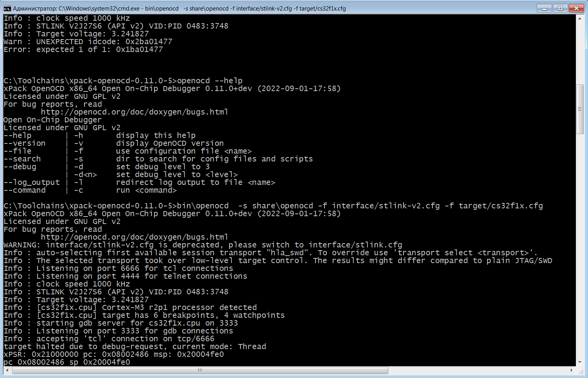

# OpenOCD Python API
Insert [for stmf103](ocd_config/cs32f1x.cfg) to targets
install [openocd xpack](https://openocd.org/pages/getting-openocd.html)

Run Server
```
bin\openocd  -s share\openocd -f interface/stlink-v2.cfg -f target/cs32f1x.cfg
```


Example for read-write freq on st-link and stm32f103
```
===== RESTART: C:\Users\r.akhmadullin\Desktop\OpenOCD_test\test_openocd.py =====
['0x1', '0x0', '0x1c0000', '0x80000005', '0x10000', '0x20000008', '0x40012800', '0x1', '0x40012400', '0x1200']
['0x2', '0x0', '0x1c0000', '0x80000005', '0x10000', '0x20000008', '0x40012800', '0x1', '0x40012400', '0x1200']
['0x3', '0x0', '0x1c0000', '0x80000005', '0x10000', '0x20000008', '0x40012800', '0x1', '0x40012400', '0x1200']
['0x4', '0x0', '0x1c0000', '0x80000005', '0x10000', '0x20000008', '0x40012800', '0x1', '0x40012400', '0x1200']
['0x5', '0x0', '0x1c0000', '0x80000005', '0x10000', '0x20000008', '0x40012800', '0x1', '0x40012400', '0x1200']
['0x6', '0x0', '0x1c0000', '0x80000005', '0x10000', '0x20000008', '0x40012800', '0x1', '0x40012400', '0x1200']
['0x7', '0x0', '0x1c0000', '0x80000005', '0x10000', '0x20000008', '0x40012800', '0x1', '0x40012400', '0x1200']
['0x8', '0x0', '0x1c0000', '0x80000005', '0x10000', '0x20000008', '0x40012800', '0x1', '0x40012400', '0x1200']
['0x9', '0x0', '0x1c0000', '0x80000005', '0x10000', '0x20000008', '0x40012800', '0x1', '0x40012400', '0x1200']
for 10 read write 0.20373320579528809 sec
```